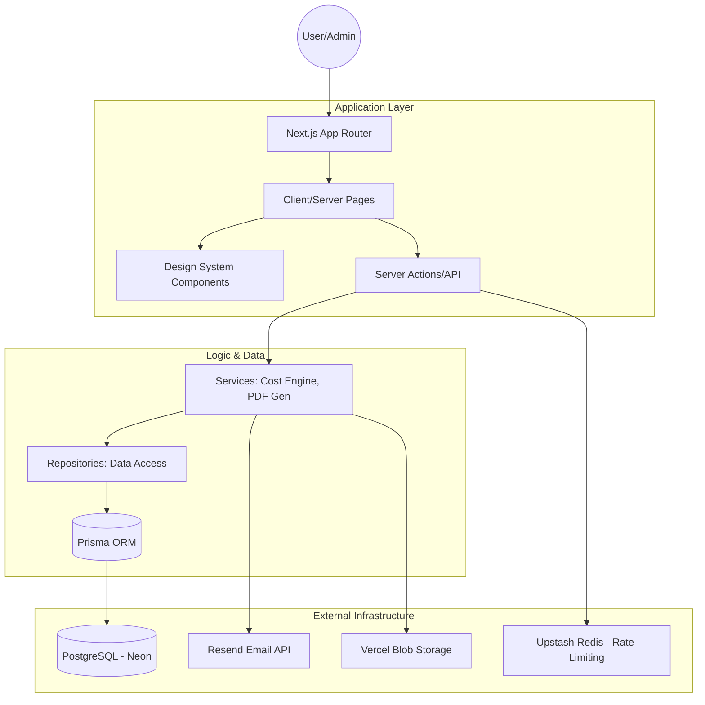

<div align="center">
  
  <h1>INOXCRAFT</h1>
  <p><strong>The Operating System for Modern Stainless Steel Fabrication</strong></p>
  
  <p>
    
    
    
    
  </p>

  <p align="center">
    <a href="#-the-pitch">The Pitch</a> •
    <a href="#-core-workflows">Workflows</a> •
    <a href="#-system-architecture">Architecture</a> •
    <a href="#-design-system">Design System</a> •
    <a href="#-getting-started">Getting Started</a>
  </p>
</div>

---

## 💡 The Pitch

For many fabrication businesses, the "Quotation to Delivery" pipeline is broken—clogged by manual spreadsheets, inconsistent pricing, and fragmented client communication. 

**INOXCRAFT** is a VC-grade SaaS solution that digitizes this entire lifecycle. It provides fabrication shops with a centralized "Source of Truth" for material costs, project tracking, and professional client engagement. It’s not just a tool; it’s the backbone of a professional fabrication operation.

## 🔄 Core Workflows

### 1. Material Intelligence
Admins manage a global directory of raw materials (Steel grades, gas, electrodes, etc.) with real-time price-per-unit updates. This ensures every quotation generated is based on current market rates.

### 2. The Smart Project Intake
Users capture project requirements through an intuitive, multi-step interface. 
- **Dimensions:** Auto-validation of L/W/H.
- **Complexity Multipliers:** Intelligence that scales labour and time based on project intricacy (Standard vs. Bespoke).
- **Material Selection:** Real-time lookup of shop materials.

### 3. Automated Quotation Engine
The system's cost engine logic:
`Total = ((Material Cost + Labour + Transport) * Complexity Multiplier) * (1 + Profit Margin)`
This results in instant, professional PDF generation ready for the client's inbox.

## 🏗 System Architecture



## 🎨 Design System

INOXCRAFT features a custom-built design system focused on **Visual Clarity** and **Industrial Aesthetics**:

- **Color Palette:** A curated `Inox` scale (Zinc/Steel grays) with high-contrast accents.
- **Glassmorphism:** Subtle background blurs and border-transparencies for a premium "Apple-like" feel.
- **Micro-Animations:** Powered by `Framer Motion` for spring-based transitions and `React CountUp` for real-time cost feedback.
- **Responsiveness:** A "Mobile-First" shell that scales gracefully to ultra-wide industrial monitors.

## 💻 Tech Stack

- **Frontend:** Next.js 14, Tailwind CSS, shadcn/ui, Framer Motion.
- **Backend:** Next.js API Routes, Server Actions.
- **Database:** PostgreSQL (Neon), Prisma ORM.
- **Security:** NextAuth.js v5, Zod Validation, Upstash Redis Rate Limiting.
- **Infrastructure:** Vercel, Resend, Vercel Blob.

## 🚀 Getting Started

### Prerequisites
- Node.js 18+ 
- PostgreSQL Database (Local or Neon.tech)
- Redis Instance (Upstash recommended)

### Installation
1. **Clone & Install:**
   ```bash
   git clone https://github.com/your-username/inoxcraft.git
   cd inoxcraft
   npm install
   ```

2. **Environment Configuration:**
   Create a `.env.local` file based on `.env.example`:
   ```env
   DATABASE_URL="postgresql://..."
   NEXTAUTH_SECRET="..."
   RESEND_API_KEY="..."
   UPSTASH_REDIS_REST_URL="..."
   UPSTASH_REDIS_REST_TOKEN="..."
   ```

3. **Database Initialization:**
   ```bash
   npx prisma migrate dev
   npx prisma db seed
   ```

4. **Launch:**
   ```bash
   npm run dev
   ```

---

<p align="center">
  Built with ❤️ for the Fabrication Industry.
</p>
